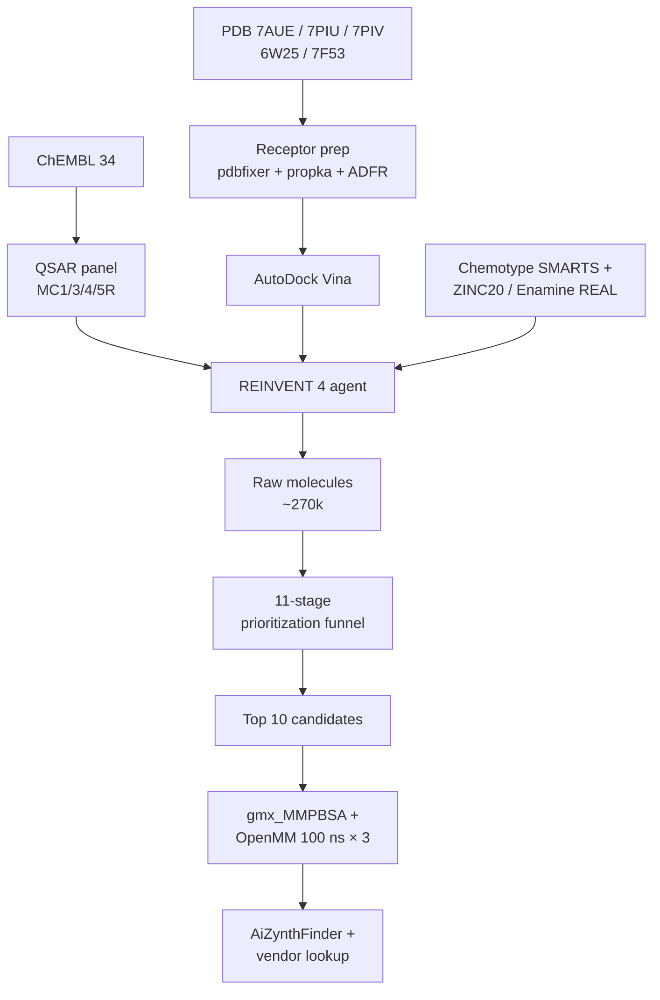

# mc4gen

[](https://github.com/owner/mc4gen/actions/workflows/ci.yml)
[](https://pypi.org/project/mc4gen/)
[](https://mypy.readthedocs.io/en/stable/)
[](LICENSE)
[](#why-fully-open-source)

Reproducible, 100% open-source *de novo* design of small-molecule agonists of the **melanocortin-4 receptor (MC4R)** that are biased for MC4R over MC1R, MC3R and MC5R. Built around [REINVENT 4](https://github.com/MolecularAI/REINVENT4) with custom structure-based scoring plugins, a four-receptor QSAR panel trained on ChEMBL, AutoDock Vina docking against five public cryo-EM structures, and OpenMM MD stability testing — no license-gated software anywhere in the pipeline.

## Install

```bash
pip install mc4gen            # base
pip install "mc4gen[app]"     # + Streamlit companion
pip install "mc4gen[dev]"     # + test & lint stack
pip install "mc4gen[rascore]" # + RAscore (git install)
```

External command-line tools that must be on `$PATH`: `antechamber`, `packmol-memgen` (both from AmberTools). GPU is optional — OpenMM falls back to CPU.

## 50-line minimal example

```python
from pathlib import Path
from mc4gen.pipeline.run_reinvent import run_reinvent_stage
from mc4gen.pipeline.prioritize import run_prioritization

config = Path("configs/stage_2_rl_7piu.toml")
raw = run_reinvent_stage(config, output_dir=Path("runs/7piu"))
final = run_prioritization(raw, max_candidates=10)
for candidate in final:
    print(candidate.smiles, candidate.predicted_pki_mc4r, candidate.vina_score)
```

## Methods

| Component | Implementation | Replaces |
|---|---|---|
| Generator | REINVENT 4 de novo prior | — |
| RL | REINVENT / AHC / Augmented Memory | — |
| Docking | AutoDock Vina 1.2 + smina | Glide SP |
| MM-GBSA rescoring | `gmx_MMPBSA` + OpenMM | Prime MM-GBSA |
| Ligand prep | `meeko` + `dimorphite-dl` + RDKit | LigPrep |
| Receptor prep | `pdbfixer` + `propka` + ADFR | Protein Prep Wizard |
| Interactions | PLIP + ProLIF | MOE / GRID |
| MD | OpenMM + AMBER14 + Lipid17 | Desmond |
| Retrosynthesis | AiZynthFinder | — |
| Synthetic accessibility | RAscore | — |

## Design philosophy

**REINVENT-4-native.** Every structure-based and ML scoring term is a REINVENT 4 plugin registered through `project.entry-points` — no monkey-patching, no forked branches. Users can swap individual components without touching the RL core.

**Selectivity-first objective.** MC4R affinity alone has driven MC1R-mediated side effects (skin hyperpigmentation) in clinical agents; `mc4gen` scores a four-receptor panel by default and rewards selectivity deltas, not absolute potency.

**Structure-ensemble averaging.** The Vina score is averaged across five independent MC4R cryo-EM structures (7AUE, 7PIU, 7PIV, 6W25, 7F53). Candidates are required to score well on at least two.

## Why fully open-source

Structure-based generative chemistry is dominated by commercial toolchains — Schrödinger, OpenEye, MOE — and published pipelines frequently assume institutional licenses worth five figures annually. `mc4gen` deliberately reimplements every step with permissively licensed alternatives: Vina for Glide, `gmx_MMPBSA` for Prime, `meeko`/`dimorphite-dl` for LigPrep, RDKit for CORINA/OMEGA, PLIP for GRID. The result is slower and occasionally noisier than the commercial stack — we document that honestly — but it runs on a fresh clone in any research group worldwide with nothing more than a Python environment and internet access.

## Honest limitations

- Vina rank-ordering is noisier than Glide SP; we mitigate with ensemble averaging over five structures but report the Spearman correlation to experimental pKi on held-out MC4R actives prominently.
- The QSAR panel is bounded by ChEMBL coverage. MC3R and MC5R datasets are smaller and their applicability domains narrower; we flag out-of-domain predictions and exclude them from headline claims.
- **No wet-lab validation.** Every candidate is a computational hypothesis.
- **Biased signaling is not predicted.** Setmelanotide's Gq/11 vs. Gs bias is a functional property not captured by structure-based scoring; `mc4gen` does not attempt to score bias.
- Docking pose ↔ functional agonism is an unvalidated assumption for any structure-based generative protocol, commercial or not.

## Architecture



## Run order

1. `python analyses/01_chembl_descriptive.py`
2. `python analyses/02_structure_preparation.py`
3. `python analyses/03_qsar_training_and_validation.py` *(gate: MC4R R² ≥ 0.5)*
4. `python analyses/04_reinvent_runs.py` *(21 runs)*
5. `python analyses/11_compound_prioritization.py`
6. `python analyses/12_docking_rescoring.py`
7. `python analyses/13_md_stability.py`
8. `python analyses/14_synthesis_candidate_generation.py`
9. `python analyses/15_benchmark_vs_setmelanotide.py`

## License

MIT. Every runtime dependency is permissively licensed (Apache 2.0, MIT, BSD, LGPL, or GPL-compatible).
